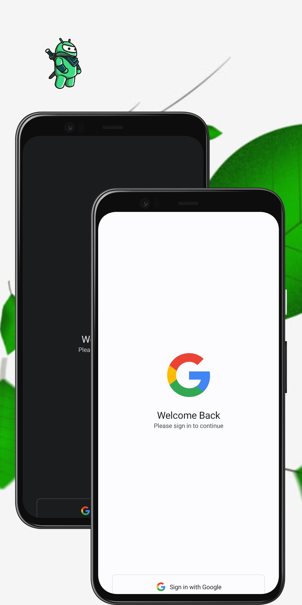
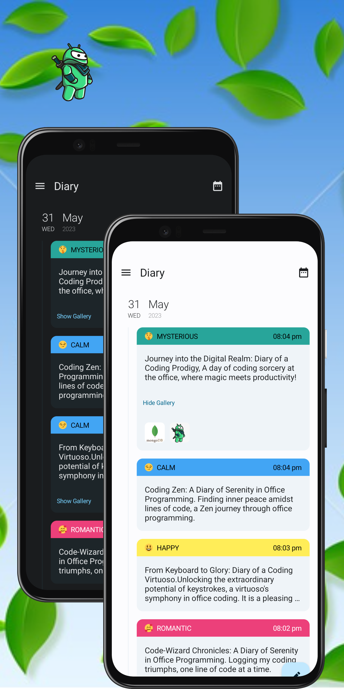
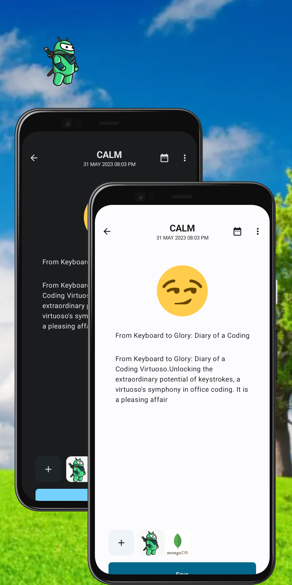
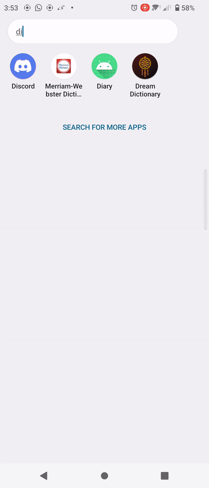
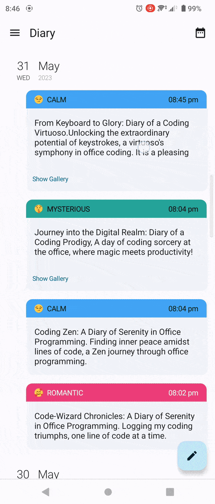

 

  

<h1 align = "center">
<b><i>DiaryApp</i></b>
</h1>

  

    Complete Multi-Modular Android App 
     

  
[Screenshots](#camera_flash-screenshots-camera_flash) ~
[Deployment](#inbox_tray-deployment-inbox_tray) ~
[Architecture](#hammer_and_wrench-architecture-hammer_and_wrench) ~
[API Reference](#electric_plug-api-reference-electric_plug) ~
[Tech Stack](#gear-tech-stack-gear) ~
[Authors](#black_nib-authors-black_nib) ~
[Contributing](#passport_control-contributing-passport_control)  
 

    
DiaryApp is a complete course project written in Kotlin and powered by Jetpack Compose. It incorpolates both Single and Multi-Modular approaches while the Data is handled by a MongoDB Sync and Firebase Combo.

DiaryApp allows users to write and save diary entries with the option to include photos and expressive emojis to capture the essence of each moment. 

This project is a valuable resource for developers seeking to learn multi-modular architecture from scratch. 

Start your next Android chapter by buying [must have course](https://stevdza-san.com/p/multi-module-android-development-with-mongo-db-realm-sync)

There are even [more courses for you here](https://stevdza-san.com/courses)

# :camera_flash: **Screenshots** :camera_flash:

DiaryApp follows the latest Material 3 guidelines for a visually appealing and consistent UI.

 &nbsp;&nbsp;&nbsp;&nbsp;
 &nbsp;&nbsp;&nbsp;&nbsp;   
 &nbsp;&nbsp;&nbsp;&nbsp; 

## Deployment
These are the key parameters for Yummies

| Parameter      | Value |
|----------------|-------|
| compileSdk     | 33    |
| targetSdk      | 33    |
| minSdk         | 21    |
| composeVersion | 1.4.0 |
| kotlinVersion  | 1.8.0 |
You can clone the repository or download or download the Zip file [here](https://github.com/stevdza-san/DiaryApp)

## Architecture
 
DiaryApp is initially implemented using Android Clean Architecture that follows the more familiar *Model-View-ViewModel* (MVVM) pattern.

On the [second branch](https://github.com/stevdza-san/DiaryApp/tree/multi_module) the project is restructured into a Multi-Module Architecture using layered features for 

for code reusability, maintainability, and scalability. Here's an overview of the app's architectural components:
- **App Module**: This is the main module of the DiaryApp, whhich acts as the orchestrator of the different features and modules. It handles the navigation flow between the Authentication, Home, and the Write features, ensuring a cohesive and seamless user experience. The App Module integrates the dependencies from the feature modules and manages the overall lifecycle of the app.

- **buildSrc**:The buildSrc module in the Android Diary App serves as a central location for managing project configuration and dependencies. This module allows for a streamlined and standardized setup of project configurations, build scripts, and dependencies, simplifying the build process and ensuring consistency across the app.

- **Data Module**:The Data module in the Android Diary App is responsible for managing data storage and retrieval using both MongoDB and Room. It handles the setup and integration of Mongo Realm, allowing seamless connectivity to the MongoDB backend. The Data module provides functionalities for inserting, fetching, updating, and deleting diary entries in the MongoDB database, ensuring efficient and reliable data management. Additionally, it leverages Room, a local persistence library, to provide offline access and local caching of diary entries, enhancing the app's responsiveness and offline capabilities.

- **Common/Core Modules**: The app includes two core modules: UI and Utils. The UI module contains common Compose functions, components, and UI-related code that are shared across different features. This module promotes code reuse and consistency in the app's user interface. The Utils module provides essential utilities such as model classes, connectivity observers, constants, string and drawable resources. It ensures a centralized and efficient management of commonly used resources and functionalities.

The app has : Screen destinations which use Compose Destination to manage navigation.

| :feature:auth                       | :feature:home                       | :feature:write                      |
|-------------------------------------|-------------------------------------|-------------------------------------|
|  |  |  |

- **Authentication Feature**: This feature focuses on user authentication and validation. It utilizes Google Sign-In to ensure that users can securely access their diary entries. By authenticating users, the app guarantees that only authorized individuals can interact with their personal diaries.

- **Home Feature**: The Home feature is responsible for displaying and filtering diary entries based on the date. It provides a user-friendly interface to navigate through diary entries and quickly access specific dates. This feature enhances the user experience by organizing entries in a structured and intuitive manner.

- **Write Feature**: The Write feature enables users to create new diary entries or modify existing ones. It offers a seamless and intuitive interface for users to capture and document their thoughts, emotions, and memories. With this feature, users have full control over their diary content, empowering them to personalize and customize their entries.

By adopting a multi-modular architecture with layered features, the DiaryApp achieves a separation of concerns, enabling independent development and testing of specific functionalities. This architecture promotes code reusability, scalability, and maintainability, while providing a cohesive and enjoyable experience for users to manage and interact with their diaries.

# :gear: Tech Stack :gear:

The DiaryApp project uses many popular libraries and tools in the Android Ecosystem:

* [Jetpack Compose](https://developer.android.com/jetpack/compose) - modern toolkit for building native Android UI
* [Android KTX](https://developer.android.com/kotlin/ktx) - helps to write more concise, idiomatic Kotlin code.

* [Coroutines and Kotlin Flow](https://kotlinlang.org/docs/reference/coroutines-overview.html) - used to manage the local storage i.e. `writing to and reading from the database`. Coroutines help in managing background threads and reduces the need for callbacks.
* [Material Design 3](https://m3.material.io/) - an adaptable system of guidelines, components, and tools that support the best practices of user interface design.
* [Compose Navigation](https://developer.android.com/jetpack/compose/navigation) - used to handle all navigations and arguments passing while hiding the complex, non-type-safe and boilerplate code
* [Google Accompanist Libraries](https://github.com/google/accompanist) - these are a collection of extension libraries for Jetpack Compose. DiaryApp specifically uses Accompanist's Pager Library
* [Dagger Hilt](https://dagger.dev/hilt/) - used for Dependency Injection.
* [Coil](https://coil-kt.github.io/coil/) - an image loading library for Android backed by Kotlin Coroutines
* [SplashScreen API](https://developer.android.com/develop/ui/views/launch/splash-screen) - SplashScreen API lets apps launch with animation, including an into-app motion at launch, a splash screen showing your app icon, and a transition to your app itself.

* [Room](https://developer.android.com/topic/libraries/architecture/room) persistence library which provides an abstraction layer over SQLite to allow for more robust database access while harnessing the full power of SQLite.
* [Mongo](https://www.mongodb.com/) - MongoDB is a popular NoSQL database, used in this app for storing and managing data related to diary entries.
* [Firebase Storage](https://firebase.google.com/docs/storage/android/start) -  Firebase Cloud Storage is a scalable and reliable cloud storage solution used in the app for storing and retrieving photos associated with diary entries.
* [Firebase Auth](https://firebase.google.com/docs/auth/android/start) - Firebase Authentication provides a secure and easy-to-use authentication system, allowing users to sign in and access their diary entries securely.
* [Max Keppeler's Sheet Compose Dialog](https://github.com/maxkeppeler/sheets-compose-dialogs) - Firebase Authentication provides a secure and easy-to-use authentication system, allowing users to sign in and access their diary entries securely.

* [StevDza-San's MessageBarCompose](https://github.com/stevdza-san/MessageBarCompose) - Animated Message Bar UI that can be wrapped around your screen content in order to display Error/Success messages in your app. It is adapted and optimized for use with Compose and Material 3 projects.

* [StevDza-San's OneTapCompose](https://github.com/stevdza-san/OneTapCompose) - Animated Message Bar UI that can be wrapped around your screen content in order to display Error/Success messages in your app. It is adapted and optimized for use with Compose and Material 3 projects.

## Authors

- [@stevdza-san](https://github.com/stevdza-san)

Do Reach Out :

  * [Twitter](https://twitter.com/StevdzaS)

  * [YouTube](https://www.youtube.com/c/StevdzaSan)

Check out my online courses: 
   [Online Courses](https://stevdza-san.com/)

## Contributing

Contributions to make DiaryApp better are always welcome!

If you are interested in seeing a particular feature implemented in this app, please open a new issue after which you can make a PR!

## License

MIT License

Copyright (c) [2023] [Stefan Jovanovic]

Permission is hereby granted, free of charge, to any person obtaining a copy
of this software and associated documentation files (the "Software"), to deal
in the Software without restriction, including without limitation the rights
to use, copy, modify, merge, publish, distribute, sublicense, and/or sell
copies of the Software, and to permit persons to whom the Software is
furnished to do so, subject to the following conditions:

The above copyright notice and this permission notice shall be included in all
copies or substantial portions of the Software.

THE SOFTWARE IS PROVIDED "AS IS", WITHOUT WARRANTY OF ANY KIND, EXPRESS OR
IMPLIED, INCLUDING BUT NOT LIMITED TO THE WARRANTIES OF MERCHANTABILITY,
FITNESS FOR A PARTICULAR PURPOSE AND NONINFRINGEMENT. IN NO EVENT SHALL THE
AUTHORS OR COPYRIGHT HOLDERS BE LIABLE FOR ANY CLAIM, DAMAGES OR OTHER
LIABILITY, WHETHER IN AN ACTION OF CONTRACT, TORT OR OTHERWISE, ARISING FROM,
OUT OF OR IN CONNECTION WITH THE SOFTWARE OR THE USE OR OTHER DEALINGS IN THE
SOFTWARE.

